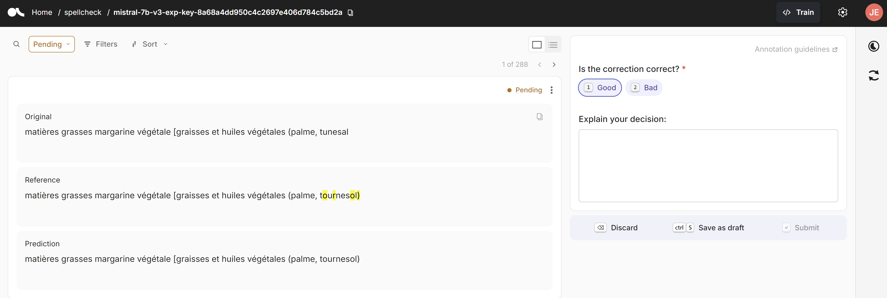

# Ingredients Spellcheck

A key element of the Open Food Facts database is the parsing of the product ingredients. These lists of ingredients either come from contributors' annotations or from OCR-extracted text from packaging pictures.

However, text typos or wrong OCR-extraction lead to ingredients not recognized by the Product Opener service. Check about this process in the [wiki](https://wiki.openfoodfacts.org/Ingredients_Extraction_and_Analysis).

For this reason, the Ingredients Spellcheck was developed to be implemented to solve this issue and improve the ingredient parsing quality. 

## TL;DR

Mistral-7B-Base was [fine-tuned](#training-pipeline) on lists of ingredients extracted from the Open Food Facts database. This [dataset](https://huggingface.co/datasets/openfoodfacts/spellcheck-dataset) was synthetically generated using closed-source LLMs (GPT-3.5-Turbo) and manually reviewed with Argilla, an open-source annotation tool.

The current model (v1) shows the best performances over the closed-source LLMs on our [benchmark](https://huggingface.co/datasets/openfoodfacts/spellcheck-benchmark). A custom [evaluation algorithm](#evaluation-algorithm) was created to correctly estimate the Spellcheck performances.


| Model | Correction Precision | Correction Recall | Correction F1
|----------|----------|----------|----------|
| GPT-3.5-Turbo | 0.557 | 0.727 | 0.631 |
| GPT-4o | 0.311 | 0.702 | 0.431 |
| Gemini-1.5-flash | 0.544 | 0.596 | 0.569 |
| Claude3-Sonnet-3.5 | 0.178 | **0.810** | 0.292 |
| **Our model** | **0.664** | 0.630 | **0.647** |

The model is integrated into Robotoff in [Batch Inference](batch-job) using Google Batch Job.

## Evaluation algorithm

Our solution is very specific: correct errors in list of ingredients to enable the [Ingredients Parser](https://wiki.openfoodfacts.org/Ingredients_Extraction_and_Analysis) to accurately identify the composition of each product. 

However, since the corrections are later added to the database, we need to ensure the model doesn't correct an ingredient by mistake. In other words, we minimize the number of False Positives while maximizing the overall Recall.

Traditional evaluation metrics, such as [ROUGE](https://en.wikipedia.org/wiki/ROUGE_(metric)), [BLEU](https://en.wikipedia.org/wiki/BLEU), or [METEOR](https://en.wikipedia.org/wiki/METEOR) fall short in assessing the quality of the spellcheck process. They don't provide a detailed analysis about how many words were correctly rectified versus those that weren't...

Therefore, we developed an algorithm that takes 3 inputs: the original, the reference, and the prediction of a  list of ingredients.

Example:
``` 
Original:       "Th cat si on the fride,"
Reference:      "The cat is on the fridge."
Prediction:     "Th big cat is in the fridge."
```

We transform each text into a sequence of tokens and perform a [sequence alignment method](https://en.wikipedia.org/wiki/Needleman%E2%80%93Wunsch_algorithm) to align identical tokens between respectively original-reference, and prediction-reference. We assign 1 or 0 whether the tokens is modified.

By comparing these 2 pairs of sequences, we calculate the number of True Positives (TP), False Positives (FP), and True Negatives (TN). Therefore, the overall Precision and Recall.

```
Orig-Ref:          1    0    0    1    0    1    1    1    1
Orig-Pred:         0    1    0    1    1    1    1    1    1
Signification:     FN   FP   TN   TP   FP   TP   TP   TP   TP
```

Coupled with a benchmark carefully prepared using the [Spellcheck Guidelines](#guidelines), the algorithm is capable of evaluating any solution, from Regular Expression techniques to LLMs.

You'll find more details about the evaluation algorithm[^evaluation-algo] in the project [README](https://github.com/openfoodfacts/openfoodfacts-ai/tree/develop/spellcheck).


## Guidelines

The [Guidelines](https://github.com/openfoodfacts/openfoodfacts-ai/tree/develop/spellcheck#-guidelines) is a set of rules defined to guide and restrict the correction made by the Spellcheck.

It was also used to create the [benchmark](https://huggingface.co/datasets/openfoodfacts/spellcheck-benchmark), and also to generate the [training dataset](https://huggingface.co/datasets/openfoodfacts/spellcheck-dataset) using proprietary LLMs (GPT-3.5-Turbo) for the synthetic data generation.

## Model

The model is accessible on [Hugging Face](https://huggingface.co/openfoodfacts/spellcheck-mistral-7b), along its [demo](https://huggingface.co/spaces/jeremyarancio/ingredients-spellcheck).

A text *instruction* is provided to the model during the training and inference, which you can find in the same model repository.

## Training pipeline

The model training consists in a succession of steps, each one requiring different resources allocations, such as cloud GPUs, data validation and logging. For this reason, we decided to orchestrate the training using [Metaflow](https://metaflow.org/), an orchestrator designed for Data science and Machine Learning projects. 

The training pipeline[^dags] is composed as follow:

* Configurations and hyperparameters are imported to the pipeline from config yaml files[^configs].
* The training job is launched in the cloud using [AWS Sagemaker](https://aws.amazon.com/sagemaker/). The `spellcheck/src/` package, containing the different modules, is imported as well as the training script[^training-script]. Once the job done, the model artifact is stored in AWS S3 bucket (private). All training details are tracked in the [Experiment Tracker Comet ML](https://www.comet.com/jeremyarancio/spellcheck/view/WzBvzCs36VdE6MIbytKEI2ePH/experiments).
* The fine-tuned model is then evaluated on the benchmark using the [custom evaluation algorithm](#evaluation-algorithm). [vLLM](https://github.com/vllm-project/vllm) is used to accelerate the evaluation. *Currently, this process is handled manually, but further work is needed to fully integrate it into the pipeline.*
* The predictions against the benchmark, also stored in AWS S3, are sent to Argilla for human-evaluation[^argilla-modules] under an unique ID: the *experiment key*. 


*Human-evaluation with Argilla*

The model and dataset versions are handled by Hugging Face repository as branch (v1, v2) and commits (v1.1, v1.2). You can easily access any version using the *Dataset* library from Hugging Face.

```python
from datasets import load_dataset
dataset  = load_dataset(
    path="openfoodfacts/spellcheck-dataset",
    revision="v8",
    split="train+test"
)
```

## Integration with Batch Job

Once the model is selected, the inference script with its dependencies are containerized in a Docker Image[^spellcheck-inference] before being pushed to the Image Registry[^makefile] (currently Google Artifact Registry). The image is then used within the [batch job pipeline](../references/batch-job.md), defined by the batch job type `ingredients-spellcheck`.

[^evaluation-algo]: see `spellcheck/src/spellcheck/evaluation/evaluator`
[^dags]: see `scripts/dags`
[^configs]: see `spellcheck/config/training`
[^training-script]: see `spellcheck/scripts/training`
[^argilla-modules]: see `spellcheck/src/spellcheck/argilla`
[^spellcheck-inference]: see `robotoff/batch/spellcheck`
[^makefile]: see `robotoff/makefile` 
